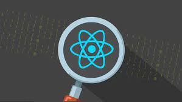

### 레포지토리 생성 목적
강의 실습 : React 완벽 가이드 with Redux, Next.js, TypeScript  

( 링크 : [https://www.udemy.com/course/best-react/](https://www.udemy.com/course/best-react/) )  
 

### 테스트 링크
[https://jongin403.github.io/react-complete-guide/index.html](https://jongin403.github.io/react-complete-guide/index.html)  
 

### 로컬에서 실행하는 방법

`git clone`  
  
`npm start`  
  
[http://localhost:3000](http://localhost:3000)
